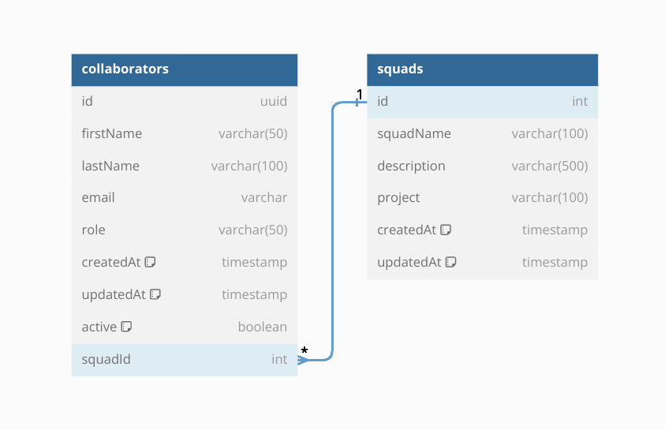

<p align="center">
  <a href="http://nestjs.com/" target="blank"></a>
  <a href="https://swagger.io/" target="blank"></a>
  <a href="https://typeorm.io/" target="blank"></a>
  <a href="https://www.postgresql.org/" target="blank"></a>
</p>
  <p align="center"><a href="https://akross-test.onrender.com/api" target="_blank">Esta API</a> foi desenvolvida com NestJS, Swagger, TypeORM e PostgreSQL como um teste técnico para uma vaga de estágio.</p>

## Descrição

### Diagrama:
<p align="center">
  </a>
</p>

## Instalação

```bash
$ npm install
```

## Ativando o App
Primeiro é necessário ativar a database:
```bash
$ docker-compose up -d
```
Depois pode ser ativada aplicação em si:

```bash
# development watch mode
$ npm run start:dev

# ou production mode
$ npm run start:prod
```
## Testando o App
Toda a documentação necessária para realizar os testes pode ser encontrada no endpoint de documentação da API:

- teste local: http://localhost:3000/api
- deploy no Render: https://akross-test.onrender.com/api

  (é necessário esperar alguns segundos
até o spool up do app, está hospedado na tier free)


## Contato

### [Github](https://github.com/erisdll)

### [LinkedIn](https://linkedin.com/in/erika-mello)
